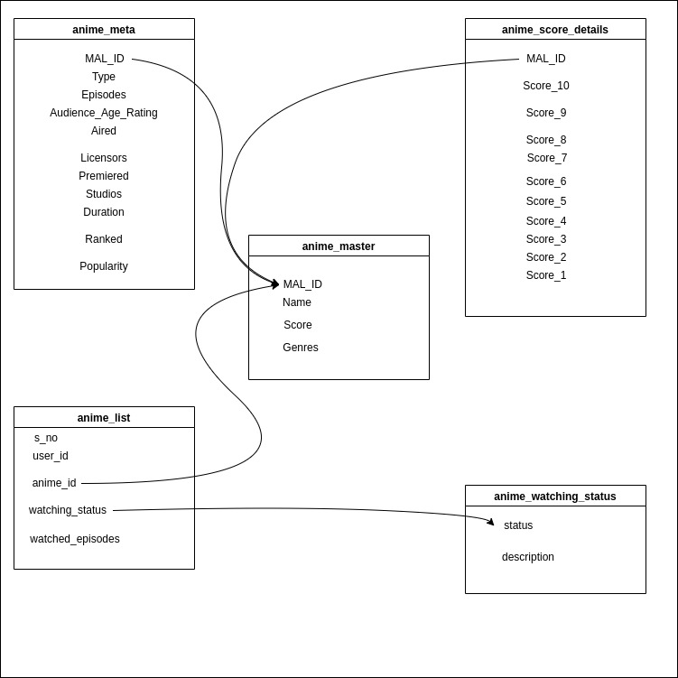
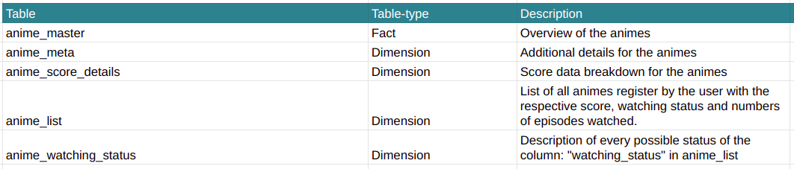

# Anime Recommendation System Data Pipeline
### Data Engineering Capstone Project

 

 

<!-- ABOUT THE PROJECT -->
## About The Project

The objective of this project was to create an ETL pipeline for an Anime Recommendation System. A use case for this pipeline is to process and use the data to train and update the recommendation algorithm, at fixed intervals.

 

### Datasets :

 

For this project, we are using a modified version of the dataset from kaggle : [Anime Recommendation Database 2020](https://www.kaggle.com/hernan4444/anime-recommendation-database-2020)

Name of the S3 bucket :    **anime-recommendation-dataset**

The dataset is stored in AWS S3. And it consists of 4 csv files :
* anime.csv : Information of anime.
* animelist.csv : List of all animes register by the user with the respective score, watching status and numbers of episodes watched. 
* watching_status.csv : Description of every possible status of the column: "watching_status" in animelist.csv.
* anime_with_synopsis.csv : CSV with synopsis of anime 

  

### Codebase :

 

* sql_queries.py : SQL queries for creating tables, inserting data into the tables, queries to perform data quality checks and dropping tables.

* requirements.txt : lists out the dependencies.

* credentials.cfg : contains the credentials and configurations for AWS and PostgreSQL Database.

* create_tables.py : python script to drop and create the tables.

* Capstone Project Template.ipynb : contains the code for the whole pipeline and the EDA process.

* static : folder that contains the static assets.

  

## Prerequisites :

 

* PostgreSQL
* Python3
* AWS access is required to access and download the Dataset from S3.
* The database config and the AWS credentials needs to be set in credentials.cfg
* Install the dependencies listed in the requirements.txt

  

## Project Steps  :

 

The project follows the follow steps:
* Step 1: Scope the Project and Gather Data
* Step 2: Explore and Assess the Data
* Step 3: Define the Data Model
* Step 4: Run ETL to Model the Data
* Step 5: Complete Project Write Up

> Please refer to the Capstone Project Template.ipynb for the details.

  

## Data Model  :

 

 

## FAQs :
* Clearly state the rationale for the choice of tools and technologies for the project.

> In this project, we have used the following tools and technologies:
> - PostgreSQL
> - Pandas
> - Python3

> The following set of tools works fine with the dataset of this size (max dataset of 8M rows) and for the requirement of few users.

---
* Propose how often the data should be updated and why.

> Ideally, the data should be updated daily. Assuming we have a system in place which records the daily user activities (which user is watching which anime), we can schedule using airflow to collect the data and process it using the ETL pipeline. This data can be further used to train & update the recommendation algorithm.

---
* Propose how often the data should be updated and why.

> Ideally, the data should be updated daily. Assuming we have a system in place which records the daily user activities (which user is watching which anime), we can schedule using airflow to collect the data and process it using the data pipeline. This data can be further used to train & update the recommendation algorithm.

---

---

<!-- Connect with me -->

   

  

